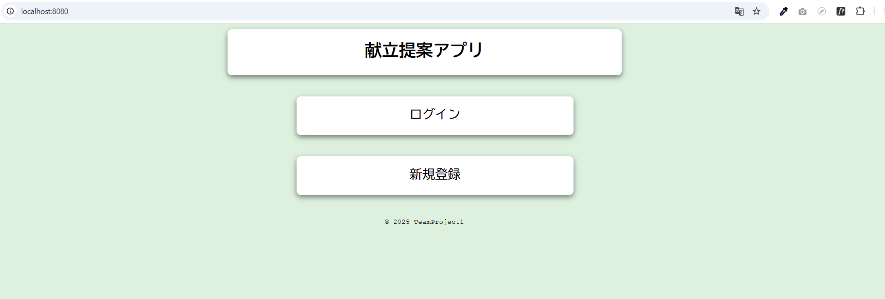

# aprentice-team-dev1-10th

## アプリ概要
献立記録＆提案アプリです。  
仕事や学業が忙しく、献立を考える暇がない。」
「健康や外見を気にかけたいが知識がない。」という現代の若者向けに**栄養バランスを意識した献立を簡単に手に入れることができるアプリ**を制作しました。


**アプリ機能**
- ログイン
- 新規登録
- ユーザー登録変更ページ  
 変更データ：体重、身長、体脂肪、筋肉量、パスワード、メールアドレス、ユーザー名、体格
- ユーザーホームページ
- 食事記録管理ページ
- 献立提案ページ
- こつこつ記録バー

## チームメンバー

- 又吉 バックエンド担当
- 城戸 バックエンド担当
- 岸部 フロントエンド担当
- 佐々木 フロントエンド担当

## 環境構築
このプロジェクトは Docker を利用してローカル環境を構築します。

- mysql:8.0
- PHP 8.3 + Apache

**前提条件**
- Docker Desktop がインストールされていること
- Docker Compose が使用可能であること

## 使い方

Docker Desktop がインストールされていること  
初期画面
http://localhost:8080/



## 開発ルール

- main ブランチは直接 push 禁止（保護ルールあり）
- 開発は以下のフローで進める
- feature/<機能名> ブランチ作成
- 作業 → push → Pull Request 作成
- PR レビュー後、main に squash merge

# ディレクトリ構成

MVC に基づくディレクトリ構造としました。

```
─ Dockerfile
├── README.md
├── app
│   ├── Controllers  #コントローラ (リクエストを受けて処理を振り分ける)
│   └── Models       #モデル (DBとやり取りするクラス)
├── config           # 設定ファイル（DB接続など）
│   └── db.php
├── database         #マイグレーション用SQLや初期データ
│   └── migrations
├── docker-compose.yml
├── gitignore
├── public
│   ├── css
│   ├── image
│   ├── index.php    #ルーティングファイル resources/views のテンプレートを読み込む
│   └── js
├── resources
│   └── views        #表示用テンプレート
└── tream
```
